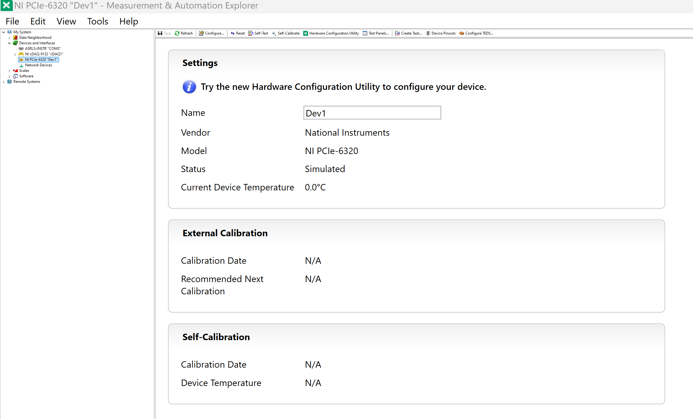
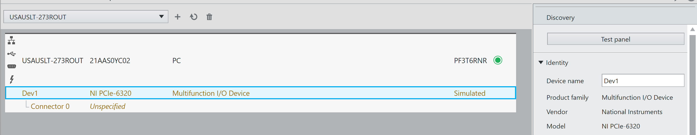

Prerequisites 
===============
In order to use the **nidaqmx** package, you must have at least one DAQ
device installed on your system. Both physical and simulated devices are supported. The
examples below use an X Series DAQ device of PCIe-6320 You can use **NI MAX** or **NI Hardware Configuration Utility** to
verify and configure your devices.

Finding and configuring device name in **NI MAX**:

Finding and configuring device name in NI Hardware Configuration Utility:

Snippet is from: https://github.com/ni/nidaqmx-python/blob/master/README.rst Getting Started Section